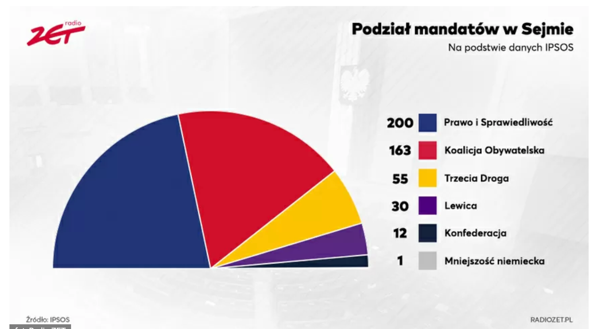
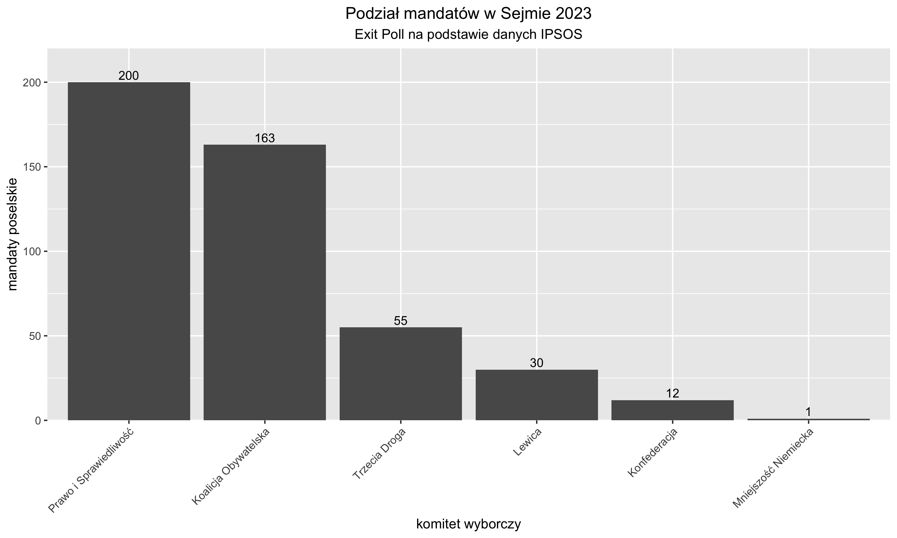

## Wizualizacja źródłowa

 Data publikacji:
15.10.2023 19:32 


Źródło:
https://wiadomosci.radiozet.pl/polska/polityka/wyniki-wyborow-2023-exit-poll-kto-wygral-wybory-podzial-mandatow-grafika

## Co należy naprawić?
- To jest wykres kołowy (technicznie połowa koła), przez co wymaga od czytelnika umiejętności porównywania ze sobą kątów, co jest problematyczne jak wiemy z wykładu.
- Użyte kolory potęgują problemy z porównywaniem kątów. Na pierwszy rzut oka wydaje się, że czerwonego jest więcej niż niebieskiego.
- Na wykresie kompletnie nie widać jednej z wartości (Mniejszość Niemiecka), co jest spowodowane typem wykresu.

## Kod
```r
library(ggplot2)
df = data.frame(
  Partia=c("Prawo i Sprawiedliwość", "Koalicja Obywatelska", "Trzecia Droga",
  "Lewica", "Konfederacja"
           , "Mniejszość Niemiecka")
  , Wynik=c(200, 163, 55, 30, 12,1)
)

ggplot(df, aes(x=reorder(Partia,Wynik, decreasing=TRUE), y=Wynik)) + 
  geom_col()+
  labs(title="Podział mandatów w Sejmie 2023", x="komitet wyborczy",
  y="mandaty poselskie", 
       subtitle = "Exit Poll na podstawie danych IPSOS")+
  theme(plot.title = element_text(hjust = 0.5),
        plot.subtitle = element_text(hjust = 0.5),
        axis.text.x = element_text(angle = 45, hjust = 1))+
  geom_text(aes(label=Wynik), vjust=-0.3, size=3.5)+
  scale_y_continuous(expand = expansion(mult = c(0, 0.1)))->plot

plot

ggsave("plot.png", plot, width=10, height=6, units="in", dpi=300)
```

## Moja wizualizacja
\


## Co jest lepsze w mojej wizualizacji?
- zmieniono typ wykresu, przez co znacznie lepiej porównywać ze sobą wyniki komitetów wyborczych.
- zrezygnowano z kolorów, co ułatwia ocenę wysokości danego słupka na tle innych. Kolory nie rozpraszają.
- wydać wynik mandatów Mniejszości Niemieckiej, co na wcześniejszej wizualizacji nie było możliwe.
- na wykresie zaznaczono też wyniki liczbowo, nie potrzeba patrzeć na legende obok wykresu.

