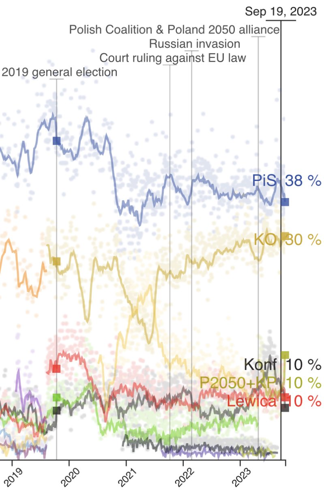
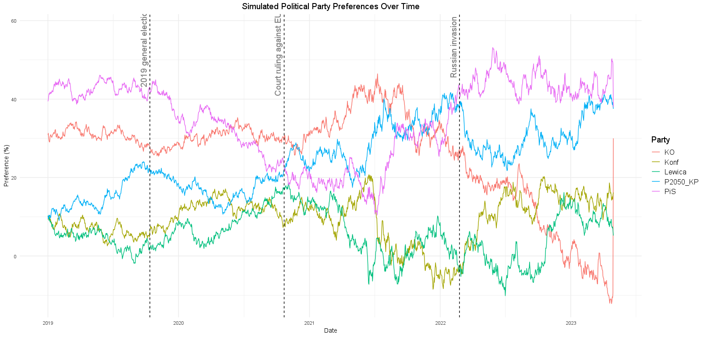

## Wizualizacja źródłowa

Wizualizacja została opublikowana dnia **22.10.2023** i pochodzi z [Twittera dziennikarza Gazety Prawnej]("https://twitter.com/tzolciak/status/1716020256714416468/photo/1").

## Uwagi do wizualizacji

 - Wizualizacja jest mało czytalna. Kropki wokół głównej linii nie wnoszą wartości do przedstawionej myśli, a jedynie utrudniają odczytanie danych.
 - Teksty przy pionowych liniach są mało czytelne. Powodują, że wizualizacja jest nieczytelna.

## Poprawiona wizualizacja

**DANE UŻYTE W WIZUALIZACJI NIE SĄ AUTENTYCZNE; MAJĄ JEDYNIE CHARAKTER POGLĄDOWY**

## Naniesione poprawki

 - Usunięcie kropek wokół głównej linii
 - Poprawienie umiejscowienia pionowych linii
 - Przeniesienie legendy na prawą stronę
 - Ideą wykresu, było przedstawienie trendu. W obecnej konfiguracji odbiorca może w pełni skupić się na konkretnej linii partii.