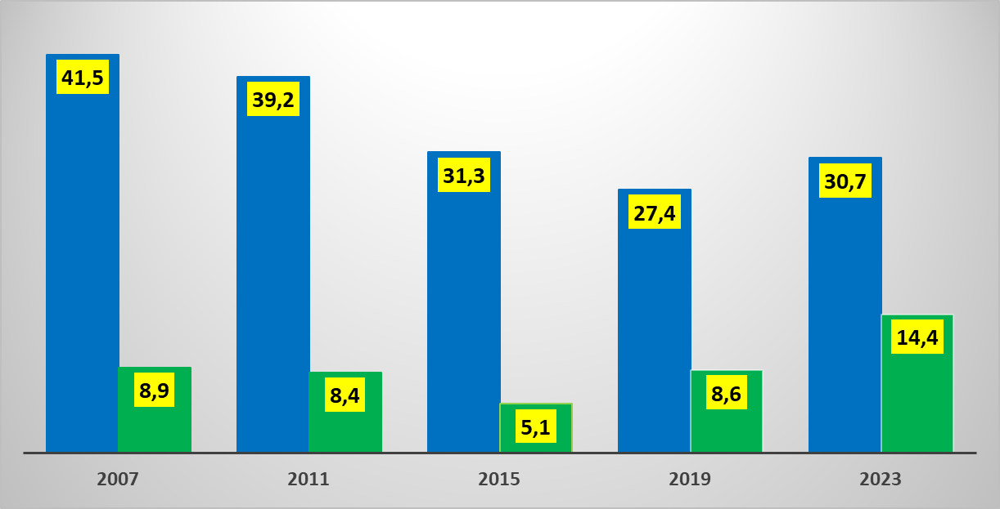

```{r setup, include=FALSE}
knitr::opts_chunk$set(echo = TRUE)
library(ggplot2)
library(dplyr)
library(tidyr)
```

## Poprawa wykresu zamieszczonego na twitterze

Postanowiłam poprawić wykres opublikowany pod adresem <https://twitter.com/MarcinPalade/status/1715100778677858446>.

Jest on niepoprawny, ponieważ nie zawiera tytułu, legendy, podpisów osi, przez co nie wiadomo nawet czego dotyczy. Dodatkowo wygląda bardzo nieestycznie, podpisy na żółtym tle są okropne.

## Wykres
{width=700px}

#Kod do nowego wykresu

```{r, kod do stworzenia poprawionego wykresu}
# Tworzymy ramkę danych
rok <- c(2007, 2011, 2015, 2019, 2023)
po_ko <- c(41.5, 39.2, 31.3, 27.4, 30.7)
psl_td <- c(8.9, 8.4, 5.1, 8.6, 14.4)
df <- data.frame(Rok = rok, 'PO_KO' = po_ko, 'PSL_TD' = psl_td)


# Przekształcamy ramkę danych do postaci długiej
df_long <- df %>% 
  pivot_longer(cols = c(PO_KO, PSL_TD), 
               names_to = "Partia", 
               values_to = "Wynik_procentowy")

#Dodajemy kolumnę z dokładną nazwą partii 
df_long <- df_long %>% 
  mutate(Partia_dokładnie = ifelse(Partia == "PO_KO" & Rok < 2019, "PO", 
                                   ifelse(Partia == "PO_KO" & Rok >= 2019, "KO", 
                                          ifelse(Partia == "PSL_TD" & Rok < 2023, "PSL", 
                                                 ifelse(Partia == "PSL_TD" & Rok >= 2023, "TD", NA)))))

  
#Rysujemy wykres
ggplot(df_long, aes(x = as.factor(Rok), y = Wynik_procentowy, fill = Partia_dokładnie)) +
  geom_col(position = position_dodge(0.75), width = 0.7) +
  labs(title = "Wyniki wyborów PO/KO i PSL/TD w latach 2007-2023",
       x = "Rok",
       y = "Wynik procentowy",
       fill = "Partia") +
  scale_fill_manual(values = c("PO" = "slateblue4", "KO" = "slateblue1", "PSL" = "limegreen", "TD" = "olivedrab2"), 
                    breaks = c("PO", "KO", "PSL", "TD"),
                    labels = c("PO", "KO", "PSL", "TD")) + 
  theme_minimal() +
  theme(plot.margin = margin(20, 20, 20, 20, "pt"), axis.title.y = element_text(margin = margin(r = 10)), plot.title = element_text(size = 12, face = "bold"))
```

## Poprawiony wykres

Na poprawionym wykresie zamieściłam wszystkie podpisy, tytuł i legendę. Zrezygnowałam z oznaczania dokładnych wartości procentowych na każdym wykresie, ponieważ dzięki siatce można je odczytać, a wykres wygląda bardziej przejrzyście. Postanowiłam również zaakcentować, w których wyborach brała udział jaka partia dokładnie, ponieważ jest to dość istotna sprawa w kontekście tego wykresu.

