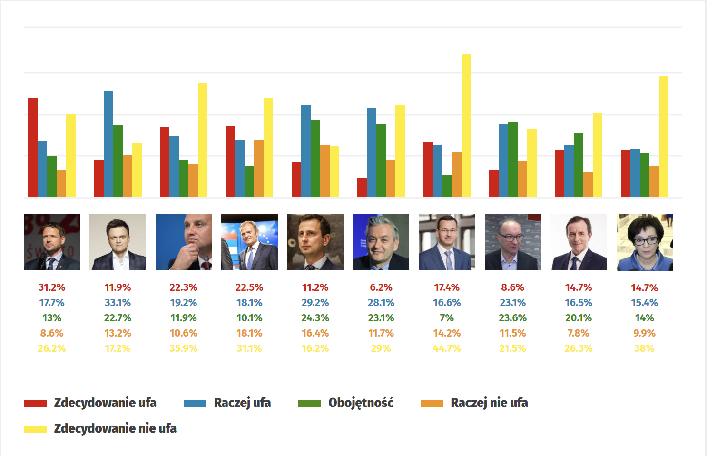

Wykres źródłowy:

źródło: https://www.wnp.pl/parlamentarny/sondaze/powyborcze-przemeblowanie-w-rankingu-zaufania-do-politykow-jest-wielki-przegrany,1359.html




Wizualizacja nie ma tytułu. Odczytywanie wartosci jest utrudnione przez umieszczenie ich pod wykresami. Dodatkowo kolory moga wprowadzac w blad gdyz kolor czerwony kojarzy sie negatywnie a zielony pozytywnie.


Mój kod wraz z wykresem:
```{r,warning=FALSE, message=FALSE}

library(tidyverse)
df <- read_csv("dane.csv")
df$name <- as.factor(df$name)
new_order <- c(
  "Zdecydowanie ufa",
  "Raczej ufa",
  "Obojętność",
  "Raczej nie ufa",
  "Zdecydowanie nie ufa"
)
df$ufnosc <- factor(df$ufnosc, levels = new_order)

```
```{r,warning=FALSE, message=FALSE,out.width="120%"}
library(plotly)
plot_ly(
  data = df,
  x=~name,
  y=~percentage,
  type="bar",
  color = ~ufnosc,
  colors = c("chartreuse2","yellowgreen","yellow2","orange2","red3")
) %>% 
layout(
  title = "Poziom zaufania społeczeństwa do wybranych polityków",
  yaxis = list(title = "Zaufanie społeczeństwa",
    tickvals = seq(0,40,10),
    ticktext = paste(seq(0,40,10),sep="","%")
    ),
  xaxis = list(title = "Polityk"),
  legend = list(
    x = 0.9, y = 1, 
    title = list(text = "Stopień zaufania")
  )
)
```
Wykres jest lepszy bo pozwala na odczytanie wartosci bezposrednio ze slupkow dzieki interaktywnosci oraz kolory kojarza sie z wartosciami ktore przedstawiaja.