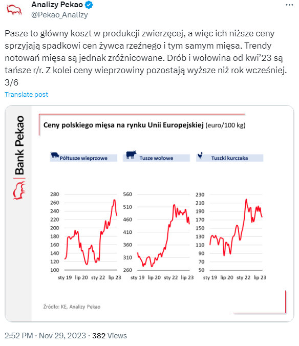

```{r setup, include=FALSE} 
knitr::opts_chunk$set(warning = FALSE, message = FALSE) 
```

## Wizualizacja źródłowa
Wizualizacja, którą będę poprawiał jest fragment wpisu na twitterze grupy Analizy Pekao:
```{r pressure, echo=FALSE, out.width = '50%'}


```

Link: <https://twitter.com/Pekao_Analizy/status/1729860995819221190>

Dzięki dopiskowi, w wizualizacji poprawianej o źródle udało mi się odnaleźć dane z oficialnej strony Komisji Europejskiej

## Co wymaga poprawy
* Oś y jest wyskalowana nie od 0 co może być mylące
* Na osi x daty mają nieregularny odstęp czasu i nie da się dobrze odczytać, ile kosztowało dane mięso w danym czasie
* Jako, że to twitter, wykres najczęściej będzie oglądany na ekranie telefonu. Trzy wykresy obok siebie są raczej zbyt małe na takim urządzeniu, by dało się odczytać czy na pewno wpis mówi prawdę

## Kod

##### Pobieranie, filtrowanie i ujednolicanie danych
```{r}
library(plotly)
library(dplyr)
library(stringr)
library(tidyr)
# Pobranie i czyszczenie beefDf
beefDf <- read.csv("./Data/BeefPrices.csv")
beefDf <- tibble(beefDf)
beefDf <- beefDf %>% 
  select(Member.State.Code, Week...Begin.Date, Category, Price) %>%
  filter(Member.State.Code == "PL", Category == "Adult male indicative price") %>%
  mutate(Date = as.Date(Week...Begin.Date, "%d/%m/%Y")) %>%
  select(-Week...Begin.Date, -Category) %>%
  arrange(Date) %>%
  filter(Date >= as.Date("2019-01-01"))

# Pobranie i czyszczenie porkDf
porkDf <- read.csv("./Data/PigmeatCarcasesPrices.csv")
porkDf <- tibble(porkDf)
porkDf <- porkDf %>%
  select(Member.State.Code, Week...Begin.Date, Pig.Class, Price) %>%
  filter(Member.State.Code == "PL", Pig.Class == "Average S + E") %>%
  mutate(Price = as.double(str_sub(Price, 2))) %>%
  mutate(Date = as.Date(Week...Begin.Date)) %>%
  select(-Week...Begin.Date, -Pig.Class) %>%
  filter(Date > as.Date("2019-01-01")) %>%
  arrange(Date)

# Pobranie i czyszczenie poultryDf
poultryDf <- read.csv("./Data/PoultryBoilersPrices.csv", sep = ";")
poultryDf <- tibble(poultryDf)
poultryDf <- poultryDf %>%
  mutate(Price=as.double(str_replace(Price....100kg., ",", "."))) %>%
  mutate(Price=round(Price, 2)) %>%
  mutate(Member.State.Code = "PL") %>%
  select(-c(Member.State, Price....100kg.)) %>%
  mutate(Date = as.Date(Date, "%d/%m/%Y")) %>%
  select(Member.State.Code, Price, Date) %>%
  filter(Date > as.Date("2019-01-01")) %>%
  arrange(Date)

# Ostateczna ramka
finalDf <- beefDf %>% inner_join(porkDf, by = c("Member.State.Code", "Date")) %>%
  rename(Beef = Price.x, Pork = Price.y) %>%
  inner_join(poultryDf, by = c("Member.State.Code", "Date")) %>%
  rename(Poultry = Price) %>%
  select(Date, Beef, Pork, Poultry) %>%
  pivot_longer(!Date, names_to = "MeatType", values_to = "Price")
```


##### Przygotowywanie adnotacji
```{r}
# Adnotacje
high_beef <- list(
  x = beefDf$Date[beefDf$Price == max(beefDf$Price)],
  y = max(beefDf$Price),
  text=paste("Highest Beef Price: ", max(beefDf$Price)),
  ax = -20, ay = -20
)
high_pork <- list(
  x = porkDf$Date[porkDf$Price == max(porkDf$Price)],
  y = max(porkDf$Price),
  text = paste("Highest Pork Price: ", max(porkDf$Price)),
  ax = -100, ay = -20
)
high_poultry <- list(
  x = poultryDf$Date[poultryDf$Price == max(poultryDf$Price)],
  y = max(poultryDf$Price),
  text = paste("Highest Poultry Price: ", max(poultryDf$Price)),
  ax = -20, ay = -20
)
low_beef <- list(
  x = beefDf$Date[beefDf$Price == min(beefDf$Price)],
  y = min(beefDf$Price),
  text=paste("Lowest Beef Price: ", min(beefDf$Price)),
  ax = 10, ay = 20
)
low_pork <- list(
  x = porkDf$Date[porkDf$Price == min(porkDf$Price)][1],
  y = min(porkDf$Price),
  text=paste("Lowest Pork Price: ", min(porkDf$Price)),
  ax = 50, ay = 30
)
low_poultry <- list(
  x = poultryDf$Date[poultryDf$Price == min(poultryDf$Price)],
  y = min(poultryDf$Price),
  text=paste("Lowest Poultry Price: ", min(poultryDf$Price)),
  ax = -30, ay = 30
)
```

##### Przygotowanie przycisków na wykresie
```{r}
# Buttony
updatemenus <- list(
  list(
    active = -1,
    type= 'buttons',
    buttons = list(
      list(
        label = "Show highs",
        method = "update",
        args = list(list(visible = c(TRUE)),
          list(annotations = list(high_beef, high_pork, high_poultry))
          )),
      
      list(
        label = "Show lows",
        method = "update",
        args = list(list(visible = c(TRUE)),
                    list(annotations = list(low_beef, low_pork, low_poultry))
        )),
      
      list(
        label = "Hide annotations",
        method = "update",
        args = list(list(visible = TRUE),
          list(annotations = list())
          ))
    )
  )
)
```


##### Stworzenie docelowego wykresu
```{r, out.width="100%"}
plot_ly(
  data = finalDf,
  x = ~Date,
  y = ~Price,
  color = ~MeatType,
  colors = c("red3", "pink3", "orange"),
  type = "scatter",
  mode = "lines"
) %>% layout(
  title = "Polish meat prices in Europe 2019-2023",
  xaxis = list(rangeslider = list(type = "date")),
  yaxis = list(title = "Price in € for 100kg",
               range = c(0, 600)),
  updatemenus = updatemenus
) %>% config(
  displayModeBar = FALSE
)
```

## Dlaczego ten wykres jest lepszy
* Dobrze wyskalowana oś y
* Dodany slider do wybrania okresu, który nas interesuje
* Regularna oś x
* Możemy zobaczyć adnotacje, gdzie na wykresie cena danego mięsa osiągnęła maksimum i minimum
* Jesteśmy w stanie sprawdzić dokładną cenę w danym miesiącu poprzez najechanie na wykres myszką


