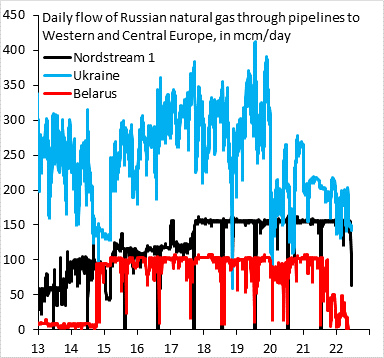

## Wizualizacja źródłowa

Wizualizacja pochodzi z [Twittera]("https://twitter.com/RobinBrooksIIF/status/1538133742706839552").




## Uwagi do wizualizacji

 - Wizualizacja jest mało czytalna. Linie są zbyt grube, nachodzą na siebie.
 - Przez to, że dane są oscylacyjne, wykes jest bardzo chaotyczny i ,,męczący'' dla oka.
 - Wprowadzenie suwaka do zmieniania zakresu, w celu analizy danych na mniejszej skali. Wówczas chaotyczność danych jest mniej widoczna.

## Poprawiona wizualizacja

```{r plotly-plot, echo=FALSE, message=FALSE}
source("./script.R")
fig
```
**DANE UŻYTE W WIZUALIZACJI NIE SĄ AUTENTYCZNE; MAJĄ JEDYNIE CHARAKTER POGLĄDOWY**

## Naniesione poprawki

 - Zmniejszenie grubości linii
 - Przeniesienie legendy na prawą stronę
 - Dodanie opacity na linie i wprowadzenie 5-dniowej średniej kroczącej, dla ustalenie uwagi na trend, który był założeniem wizualizacji.