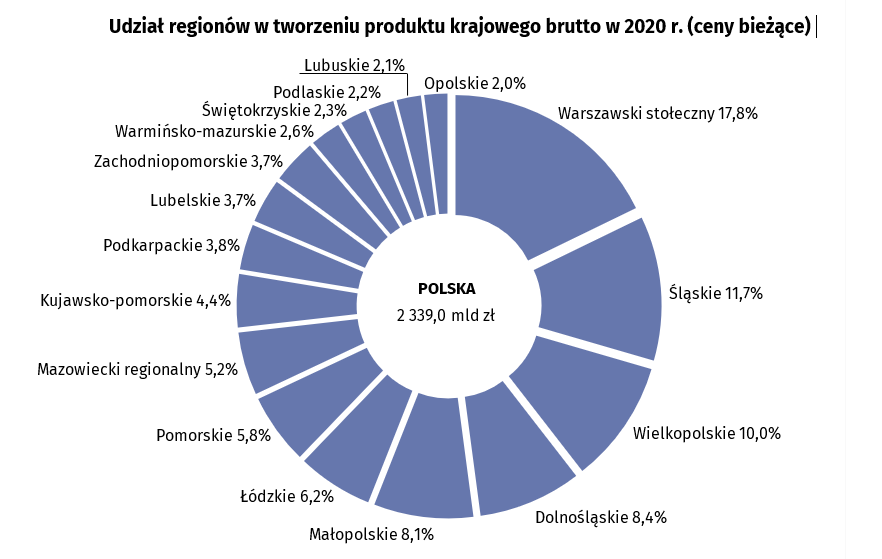

```{r setup, include=FALSE}
knitr::opts_chunk$set(echo = TRUE)
```

## Wizualizacja źródłowa

Postanowiłem poprawić wykres pochodzący z artykułu zamieszczonego w Serwisie Samorządowym PAP dnia 29 września 2022 roku (link: <https://samorzad.pap.pl/kategoria/aktualnosci/nowe-dane-gus-te-piec-regionow-generuje-polowe-polskiego-pkb>).




### Uzasadnienie

Moim zdaniem ten wykres wymaga poprawy przede wszystkim dlatego, że jest to 
wykres kołowy, a więc gdyby nie podpisy, utrudniałby znacząco porównanie udziałów
poszczególnych regionów w łącznym polskim PKB. Można by także dołączyć informację
ile nominalnie wynosi PKB danego regionu -- poszerzyłoby to ilość informacji możliwych
do odczytania z wykresu.

## Poprawiona wizualizacja

### Dane źródłowe

Dane źródłowe pochodzą ze strony Banku Danych Lokalnych GUS (link: <https://bdl.stat.gov.pl>).

### Wykres i kod źródłowy

```{r, message=FALSE, warning=FALSE}
library(dplyr)
library(plotly)

data <- readr::read_delim("dane.csv", ";")

colnames(data) <- c('kod', 'nazwa', 'pkb_mln', '')

data <- data %>% 
  select(nazwa, pkb_mln) %>% 
  mutate(nazwa = case_when(nazwa == "POLSKA" ~ "Polska",
                           TRUE ~ tolower(nazwa)),
         pkb_mld = pkb_mln * 10^(-3)) %>% 
  mutate(nazwa = gsub("^region ", "", nazwa))

plot <- data %>%
  plot_ly(
    type = "treemap",
    labels = ~nazwa,
    parents = c("", rep("Polska", times = length(data$nazwa) - 1)),
    values = ~pkb_mld,
    branchvalues="total",
    texttemplate = "<b> %{label} </b> <br> %{value} mld zł <br> %{percentParent}",
    textposition="inside",
    hovertemplate = "<b> %{label} </b> <br> %{value} mld zł <br> %{percentParent:%}",
    name = ""
  ) %>% 
  layout(
    title = "<b> Udział regionów w tworzeniu produktu krajowego brutto w 2020 r.</b>",
    separators = ", "
  )

plot
```

### Uzasadnienie

Poprawiona wizualizacja to wykres typu "mapa drzewa", który pomaga nam lepiej
porównywać proporcje, a gdyby nadal czytelnik miał z tym problem, to na każdym z
prostokątów są zawarte wszystkie informacje -- tak jak wspomniałem wcześniej, na 
oryginalnym wykresie nie była zawarta informacja o nominalnym PKB poszczególnych
regionów. W niektórych proporcjach okna, podpisy części prostokątów nie są 
dobrze widoczne, jednak problem ten znika gdy na dany prostokąt najedziemy. 
W ten sposób także możemy odczytać PKB Polski -- najeżdżając na napis "Polska".
