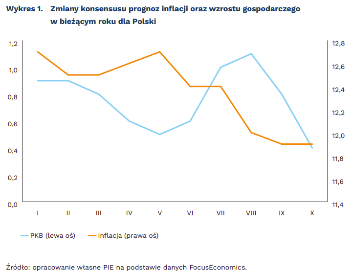

# Źródło
Wykres pochodzi z artykułu: *https://obserwatorgospodarczy.pl/2023/11/03/pkb-polski-w-2023-roku-nie-urosnie-nawet-o-05-czy-w-2024-roku-bedzie-lepiej/*.


{width=70%}


**Błędy w wizualizacji**  
1. Wykresy wyglądają jakby przedstawiały wartości z tego samego zakresu, chociaż w rzeczywistości prezentują zupełnie różne wielkości.  
2. Z powodu dwóch osi Y odbiorca może źle zinterpretować zmiany wartości. Duża względna zmiana wartości na jednej skali wygląda tak samo jak mała zmiana na skali drugiej.  
3. Trudno odczytać wartości z wykresu, brakuje linii pomocniczych.

\newpage

# Poprawiona wizualizacja

Poniżej znajduje się kod potrzebny do wygenerowania wizualizacji oraz wykresy.\

```{r, message=FALSE, warning=FALSE}
library(plotly)
```

```{r}
df <- data.frame(month = c("I", "II", "III", "IV", "V", "VI", "VII", "VIII", "IX", "X"),
                 gdp = c(0.95, 0.95, 0.8, 0.6, 0.55, 0.6, 1.0, 1.1, 0.8, 0.4),
                 inflation = c(12.7, 12.6, 12.6, 12.65, 12.7, 12.4, 12.4, 12.0, 11.9, 
                               11.9))
```

```{r, fig.show="hide", warning=FALSE}
gdp_plot <- 
  plot_ly(df, 
          x = ~factor(month, level=month), 
          y = ~gdp, 
          type = "scatter", 
          mode = "lines+markers",
          hoverinfo = "text",
          text = ~paste("</br><b>Miesiąc:</b> ", month, "</br><b>Wzrost PKB:</b> ", gdp, "%")) %>% 
  layout(title = "<b>Wykres 1. Zmiany konsensusu prognoz wzrostu gospodarczego
w biezacym roku dla Polski</b>",
         xaxis = list(title = "<b>Miesiąc</b>"),
         yaxis = list(title = "<b>PKB [%]</b>",
                      range = c(0, 1.2),
                      zeroline = FALSE))
  
```

```{r, warning=FALSE}
inflation_plot <- 
  plot_ly(df, 
          x = ~factor(month, level=month), 
          y = ~inflation, 
          type = "scatter", 
          mode = "lines+markers",
          hoverinfo = "text",
          color = T,
          colors = c("orange"),
          text = ~paste("</br><b>Miesiąc:</b> ", month, "</br><b>Prognoza inflacji:</b> ", inflation, "%")) %>% 
  layout(title = "<b>Wykres 2. Zmiany konsensusu prognoz inflacji w biezacym 
roku dla Polski</b>",
         xaxis = list(title = "<b>Miesiąc</b>"),
         yaxis = list(title = "<b>Inflacja [%]</b>",
                      range = c(11, 14),
                      zeroline = FALSE))
```

\newpage

```{r, echo=FALSE, fig.align="center", out.width="80%"}
gdp_plot
inflation_plot
```

**Zalety nad oryginalną wizualizacją**  
1. Dwa wykresy zamiast jednego dają większą klarowność i przejrzystość.  
2. Odbiorca nie musi się zastanawiać która oś odpowiada danemu wykresowi.  
3. Trudniej pomylić się przy porównywaniu wartości prezentowanych wskaźników.  
