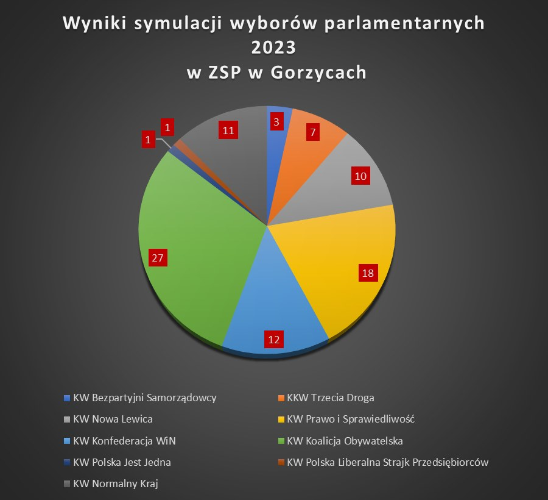

```{r setup, include=FALSE}
knitr::opts_chunk$set(echo = TRUE)
```

# Źródło
Wykres pochodzi z posta na Facebooku: 

*https://www.facebook.com/ZSPnr1Gorzyce/posts/pfbid0n2uEvFJhRm2iH7F4tLbU2AVqBNBbA6Je3bRTjk9zhgKRmc2Biy4iRad6VKaG1A5tl* 
z dnia 16.10.2023 r.

<center>

{width=60%}

<center>

**Błędy w wizualizacji**  
1. W wykresie kołowym sporządzone wartości zazwyczaj sumują się do 100%. Przy takim wyborze wykresu należałoby oznaczyć wycinki liczbą procentów, a nie ilością oddanych głosów - wtedy wykres byłby czytelniejszy.\
2. Wykres jest nieczytelny: można by poszeregować wycinki koła od największego do najmniejszego, podobnie w kolejności od najbardziej do najmniej popularnego ugrupowania uszeregować legendę. Oprócz tego można by zastosować inne kolory (są 2 odcienie niebieskiego i 2 szarego, ciężkie w rozpozaniu, który jest który). 

\newpage

# Poprawiona wizualizacja

Poniżej znajduje się kod implementujący wizualizację oraz wykresy:\

```{r, message=FALSE, warning=FALSE}
library(dplyr)
library(plotly)
```

```{r}
df <- data.frame(Partie = c("KW Koalicja Obywatelska", "KW Prawo i Sprawiedliwość", "KW Konfederacja WiN",
                            "KW Normalny Kraj", "KW Nowa Lewica", "KKW Trzecia Droga", "KW Bezpartyjni Samorządowcy",
                            "KW Polska Jest Jedna", "KW Polska Liberalna Strajk Przedsiębiorców"),
                 liczba = c(27, 18, 12, 11, 10, 7, 3, 1, 1))

x <- sum(df$liczba)

df$procenty <- round((df$liczba / x * 100), 2)

```


Zdecydowałem się na zmodyfikowanie wykresu - na początku jest on słupkowy, ale można go także zmienić na kołowy, by był bardziej interaktywny

```{r, fig.show="hide", warning=FALSE}
dobry_wykres <- plot_ly(df, x = ~reorder(Partie, -procenty), y = ~procenty, type = 'bar',
                        marker = list(color = 'blue', line = list(color = 'white', width = 2)),
                        text = ~paste("Partia: ", Partie,  "<br>Procent głosów: ", procenty, "%", "<br>Liczba głosów: ", liczba),
                        hoverinfo = "text",
                        textposition = "none") %>%
  layout(title = "Wyniki symulacji wyborów 2023 w ZSP w Gorzycach",
         xaxis = list(title = "Partie", tickangle = 45, categoryorder = "total descending"),
         yaxis = list(title = "Procent głosów", tickvals = seq(0, 35, by = 5), ticktext = paste0(seq(0, 35, by = 5), "%")),
         updatemenus = list(
           list(
             x = 0.5, y = 1,
             buttons = list(
               list(method = "restyle",
                    args = list("type", "bar"),
                    label = "Wykres słupkowy"),
               list(method = "restyle",
                    args = list("type", "pie"),
                    label = "Wykres kołowy")
             ))),
         showlegend = TRUE) %>%
  config(displayModeBar = FALSE)

```


```{r, echo=FALSE, fig.align="center", out.width="80%"}
dobry_wykres
```

**Zalety nad oryginalną wizualizacją:**  
1. Wykres jest dużo czytelniejszy - od razu widać kolejność popularności partii.  
2. Czytelne osie sprawiają, że od razu można odczytać dokładny wynik partii, ponadto jest on wyświetlany przy najechaniu na wycinek koła/słupek.  
3. Została dodana informacja o procencie wszystkich głosów.  