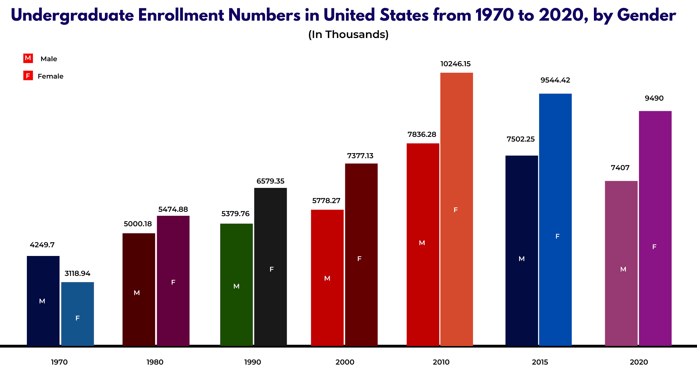

```{r setup, include=FALSE}
knitr::opts_chunk$set(echo = TRUE)
library(dplyr)
library(plotly)
```

## Poprawa wykresu dotyczącego edukacji

Postanowiłam poprawić wykres zamieszczony pod adresem <https://admissionsly.com/education-statistics/>. Wykres wydaje się być chaotyczny, ponieważ zostało na nim użyte za dużo kolorów, nie wiadomo w jakim celu. Ciężko porównać między sobą wyniki z poszczególnych lat, ponieważ nie ma siatki, jedynie podpisy na górze.

## Wykres
{width=700px}

## Kod do nowego wykresu

```{r, kod do stworzenia poprawionego wykresu}
library(plotly)
library(dplyr)

#tworzenie ramki danych
Year <- c("1970", "1970", "1980", '1980', "1990", "1990", "2000", "2000", "2010", "2010", "2015", "2015", "2020", "2020")
Gender <- rep(c("Male", "Female"), length.out = length(Year))
Numbers <- c(4249.7, 3118.94, 5000.18, 5474.88, 5379.76, 6579.35, 5778.27, 7377.13, 7836.28, 10246.15, 7502.25, 9544.42, 7407, 9490)
df <- data.frame(Year, Gender, Numbers)

#dodanie kolumny z różnicą
years <- intersect(df$Year[df$Gender == "Male"], df$Year[df$Gender == "Female"])
df <- df %>%
  mutate(Difference = ifelse(Year %in% years & Gender == "Female",
                             Numbers - lag(Numbers),
                             NA))

#tworzenie menu z przyciskami
layout <- list(
  updatemenus = list(
    list(
      x = 0.1,
      y = 1.15,
      buttons = list(
        list(
          method = "relayout",
          args = list(list(yaxis = list(title = "Numbers"))),
          label = "Both"
        ),
        list(
          method = "relayout",
          args = list(list(yaxis = list(title = "Numbers"))),
          label = "Male"
        ),
        list(
          method = "relayout",
          args = list(list(yaxis = list(title = "Numbers"))),
          label = "Female"
        ),
        list(
          method = "relayout",
          args = list(list(yaxis = list(title = "Difference"))),
          label = "Difference"
        )
      )
    )
  )
)

#rysowanie wykresu
fig <- plot_ly(df, x = ~Year, y = ~Numbers, color = ~Gender, type = "bar",
               colors = c("Both" = "gray", "Male" = "deepskyblue2", "Female" = "deeppink")) %>%
  layout(layout) %>% 
  layout(title = list(
    text = "Undergraduate Enrollment Numbers in United States from 1970 to 2020, by Gender",
    font = list(size = 12),
    y = 0.965,
    x = 0.5,
    xanchor = "center",
    yanchor = "top"), 
    annotations = list(
      list(
        x = 0.5,
        y = 0.99, 
        xref = "paper",
        yref = "paper",
        text = "(In Thousands)",
        showarrow = FALSE,
        font = list(size = 10))),
        xaxis = list(title = "Year"),
        yaxis = list(title = "Numbers",
                     tickformat = ".0f")
      )

#dodanie słupka Difference
fig <- fig %>%
  add_trace(x = ~Year, y = ~Difference, type = "bar", name = "Difference (F - M)", marker = list(color = "orange"))
 fig
```
## Poprawiony wykres

Na poprawionym wykresie użyłam dwóch kolorów do reprezentacji słupków dla kobiet i mężczyzn. Możemy wybrać na nim które dane chcemy ze sobą porównywać. Dodałam także słupek pokazujący różnicę pomiędzy ilością uczących się kobiet i mężczyzn. Siatka pozwala na łatwiejsze porównywanie danych ze sobą, natomiast jeśli chcemy poznać dokładne dane możemy najechać na interesujący słupek. 
