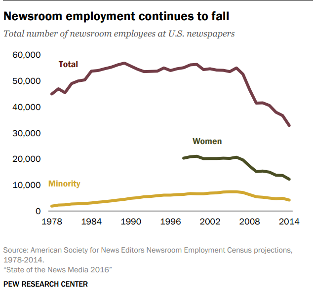

```{r setup, include=FALSE}
knitr::opts_chunk$set(echo = TRUE)
```

## Wizualizacja źródłowa

::: {style="text-align: center;"}

:::

Źródło: <https://assets.pewresearch.org/wp-content/uploads/sites/13/2016/06/30143308/state-of-the-news-media-report-2016-final.pdf> (pg.17)

Wady wizualizacji:

+ Nierozróżnialne punkty
+ Niemożliwe odczytać ani liczbę pracowników, ani rok

## Poprawiona wizualizacja
```{r message = FALSE, warning = FALSE}
library(plotly)
library(dplyr)

Year <- c(1978:2014)

Total <- c(45000,47000,45500,49000,50000,50400,53800,54000,54700,
           55300,56200,56900,55700,54500,53600,53700,53800,55000,
           54000,54700,55100,56200,56400,54400,54700,54200,54100,
           53600,55000,52600,46700,41500,41600,40600,38000,36700,32900)

Minority <-  c(1900,2300,2400,2700,2800,2900,3100,3400,3600,3900,
               4200,4500,4900,5100,5500,5600,5900,6100,6100,6300,
               6400,6700,6600,6600,6900,7000,7300,7400,7400,
               7100,6300,5500,5300,5000,4700,4900,4200)

Women <- c(NA,NA,NA,NA,NA,NA,NA,NA,NA,NA,NA,NA,NA,NA,NA,NA,NA,NA,NA,NA,
           20323,20876,21062,20161,20168,20177,20320,20217,20687,
           19651,17287,15180,15360,14971,13780,13657,12213)


df <- data.frame(Year, Total, Minority, Women)

```

```{r, fig.show="hide", warning=FALSE}
fig1 <- plot_ly(
  data = df,
  x = ~ Year,
  y = ~ Total,
  type = 'scatter',
  mode = 'lines+markers',
  name = "Total",
  marker = list(line = list(width = 3))
) %>%
  add_trace(y = ~ Minority,
            name = 'Minority',
            mode = 'lines+markers') %>%
  add_trace(y = ~ Women,
            name = 'Women',
            mode = 'lines+markers') %>%
  layout(
    title = list(text = "<b>Newsroom employment continues to fall</b>",
                 font = list(size = 18)),
    annotations = list(
      list(
        x = 0.5,
        y = 1.05,
        xref = "paper",
        yref = "paper",
        text = "<i>Total number of newsroom employees at U.S. newspapers",
        showarrow = FALSE,
        font = list(size = 12, color = "grey")
      )
    ),
    xaxis = list(
      title = "Year",
      tickmode = "array",
      tickvals = seq(1978, 2014, by = 6),
      ticktext = seq(1978, 2014, by = 6),
      showgrid = FALSE
    ),
    yaxis = list(title = "Employees", showgrid = FALSE),
    margin = list(t = 100),
    updatemenus = list(list(
      buttons = list(
        list(
          label = "All",
          method = "update",
          args = list(list(visible = c(TRUE, TRUE, TRUE)))
        ),
        list(
          label = "Total",
          method = "update",
          args = list(list(visible = c(TRUE, FALSE, FALSE)))
        ),
        list(
          label = "Minority",
          method = "update",
          args = list(list(visible = c(FALSE, TRUE, FALSE)))
        ),
        list(
          label = "Women",
          method = "update",
          args = list(list(visible = c(FALSE, FALSE, TRUE)))
        )
      ),
      x = 1,
      xanchor = "left",
      y = 0.5
    )),
    sliders = list(list(
      active = 11,
      currentvalue = list(prefix = "Year: "),
      steps = lapply(seq(1981, 2014, by = 3), function(year_val) {
        list(label = year_val,
             method = "update",
             args = list(list(visible = TRUE),
                         list(xaxis = list(
                           range = c(1977, year_val + 1)
                         ))))
      })
    ))
  )

```
```{r, echo=FALSE, fig.align="center"}
fig1
```

## Zmiany:

+ Wykres jest czytelniejszy
+ Można porównywać dane z poszczególnych kategorii (All, Total, Woman, Minority)
+ Można zmienić zakres wyświetlonych lat

