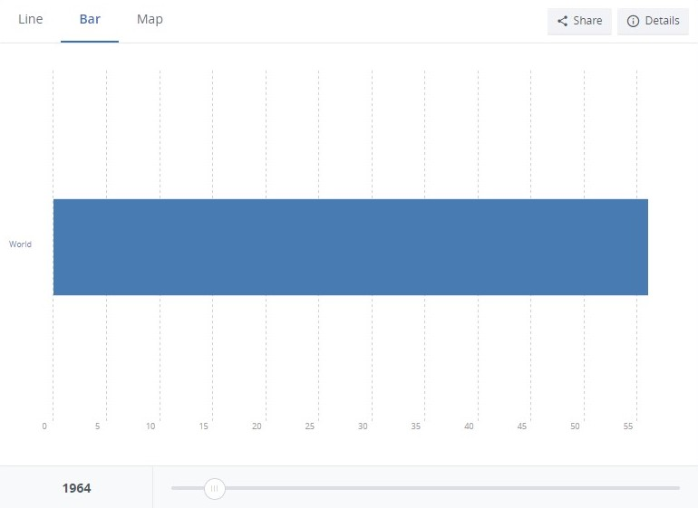

```{r setup, include=FALSE}
knitr::opts_chunk$set(message=FALSE, warning=FALSE, align = "center")
```

## Wizualizacja do poprawy

<center>

</center>

<br>

Wizualizacj nie jest poprawna, ponieważ zastosowany został wykres słupkowy zawierający tylko jeden słupek, który dla każdego roku zajmuje swoją wysokością całe okno z wykresem.

Wynikiem takiego niefortunnego sposobu prezentowania danych jest wykres, który nie tylko przez brak innych słupków uniemożliwia porównywanie długości między słupkami, tym samym mijając się z celem wizualizacji takiego typu, ale też ten pojedynczy słupek ma stałą długość niezależnie od wartości, co sprawia, że sam fakt tworzenia wykresu do zwizualizowania takich danych traci jakikolwiek sens.

## Poprawiona wizualicaja i kod użyty do jej wygenerowania

```{r code, echo=TRUE}
# Instalowanie pakietów --------------------------------------------------------
# install.packages("dplyr")
# install.packages("tidyr")
# install.packages("plotly")
# install.packages("rnaturalearth")

# Wszytywanie bibliotek --------------------------------------------------------
library(dplyr)
library(tidyr)
library(plotly)
library(rnaturalearth)

# Wczytywanie danych danych ----------------------------------------------------
life_expectancy_df <- read.csv("API_SP.DYN.LE00.IN_DS2_en_csv_v2_5994853.csv")
# Dane użyte na licencji:
# Creative Commons Attribution 4.0 (CC-BY 4.0)
# https://data.worldbank.org/indicator/SP.DYN.LE00.IN?end=1963&start=1963&view=bar&year=1964

# Przygotowywanie danych -------------------------------------------------------
tmp1 <- ne_countries(scale = "small", returnclass = "sf") %>%
  select(adm0_a3, continent)
tmp2 <- life_expectancy_df %>%
  select(-one_of(c("Indicator.Code", "Indicator.Name", "X", "X2022", "Country.Name", "Country.Code"))) %>%
  summarise_all(mean, na.rm = TRUE) %>%
  mutate(continent = "World")
df <- left_join(life_expectancy_df, tmp1, by = c("Country.Code" = "adm0_a3")) %>%
  select(-one_of(c("geometry", "Country.Code", "Country.Name"))) %>%
  drop_na(continent) %>%
  group_by(continent) %>%
  summarise_all(mean, na.rm = TRUE)
df <- bind_rows(tmp2, df)
colnames(df)[1:63] <- gsub("X", "", colnames(df)[1:63])
df <- df %>%
  pivot_longer(cols = `1960`:`2021`,
               names_to = "year",
               values_to = "Life expectancy") %>%
  mutate(hover = if_else(continent == 'World',
                         with(df, paste0("Mean life expectancy\nglobally in year ",
                                      year, ":\n", round(`Life expectancy`, 2), " years")),
                         with(df, paste0("Mean life expectancy\nin ",
                                      continent, "\nin year ",
                                      year, ":\n", round(`Life expectancy`, 2), " years"))))

# Tworzenie wykresu ------------------------------------------------------------
figure <-
plot_ly(data = df,
        y = ~continent,
        x = ~`Life expectancy`,
        type = 'bar',
        orientation = 'h',
        color = ~continent,
        frame = ~year,
        text = ~hover,
        hoverinfo = "text") %>%
  layout(title = 'Mean life expectancy in years 1960-2021',
         legend = list(traceorder= 'reversed'),
         yaxis = list(title = 'Region'),
         xaxis = list(title = 'Mean life expectancy'),
         barmode = 'group') %>%
  animation_slider(currentvalue = list(prefix = "Year ", font = list(color="black"))) %>%
  animation_opts(redraw = FALSE, mode = "immediate") %>%
  animation_button(visible = FALSE) %>%
  config(displayModeBar = FALSE) 
```

<center>
```{r plot, echo=FALSE}
figure
```
Wykres 2. Poprawiona wizualizacja
</center>

<br>

Nowa wizualizacja jest lepsza, ponieważ dodane zostały dodatkowe słupki, reprezentujące średnią oczekiwaną dalszą długość trwania życia w danym roku, pokazujące stan na konkretnych kontynentach, co umożliwia łatwe porównywanie danych między grupami. Dodatkowo zasięg wartości na osi poziomej jest stały dla wszystkich lat, dzięki czemu słupki zmieniają długość zależnie od wartości, którą reprezentują, pozwalając tym saym na łatwiejsze porównywanie danych między latami.
