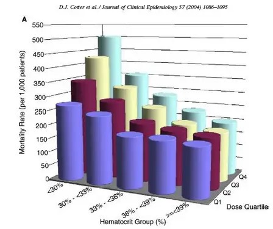

```{r setup, include=FALSE}
knitr::opts_chunk$set(echo = TRUE)

library(shiny)
library(plotly)
```

## Wizualizacja źródłowa

**Źródło**: <https://www.businessinsider.com/the-27-worst-charts-of-all-time-2013-6?IR=T#wow-multicolor-3-d-cylinder-bar-charts-are-a-really-really-bad-way-to-articulate-relatively-simple-data-19>

{width="416"}

## Wady tego wykresu

-   Trudno odczytać wartości słupków

-   Proporcje słupków z porzodu są zawyżone przez perspektywe, a tyle analogicznie tylko w drugą stronę

-   Wykres nie posiada widocznego tytułu

## Moja propozycja poprawy za pomozą Shiny i Plotly

```{r eruptions, echo=FALSE, fig.height=10, fig.width=10, warning=FALSE}
groups <- c("<30", "30-33", "33-36", "36-39", ">=39")
Q1 <- c(260, 250, 180, 200, 180)
Q2 <- c(340, 260, 210, 200, 190)
Q3 <- c(420, 320, 250, 200, 180)
Q4 <- c(500, 350, 280, 220, 200)


df <- data.frame(groups, Q1, Q2, Q3, Q4)

ui <- fluidPage(
  titlePanel("Mortality rate for each Hermatocrit Group by dose quantile"),
  sidebarLayout(
    sidebarPanel(
      selectInput("select", "Dose Quantile:",
                  choices = c("Q1", "Q2", "Q3", "Q4"),
                  selected = "Q1")
    ),
    mainPanel(
      plotlyOutput("barplot", height = "300px")
    )
  )
)


server <- function(input, output) {
  output$barplot <- renderPlotly({
    col_selected <- input$select
    hover_text <- paste("Value: ", df[, col_selected])
    
    
    
   
    df$groups <- factor(df$groups, levels = c("<30", "30-33", "33-36", "36-39", ">=39"))

    plot_ly(x = df$groups, y = df[, col_selected], type = 'bar') %>%
      layout(title = paste("by ", col_selected),
             xaxis = list(title = "Hematocrit Group (%)"),
             yaxis = list(title = "Mortality Rate (per 1000 patients)"),
             hoverinfo = "text")
  })
}


shinyApp(ui = ui, server = server)
```

## Dlaczego ten wykres jest lepszy?

-   Łatwo porównać ze sobą słupki, nie jest 3D

-   Mamy dokładną wartość na wykresie

-   nie powtarzają się (%) w legendzie osi i opisów słupków

-   Wykres posiada widoczny tytuł

