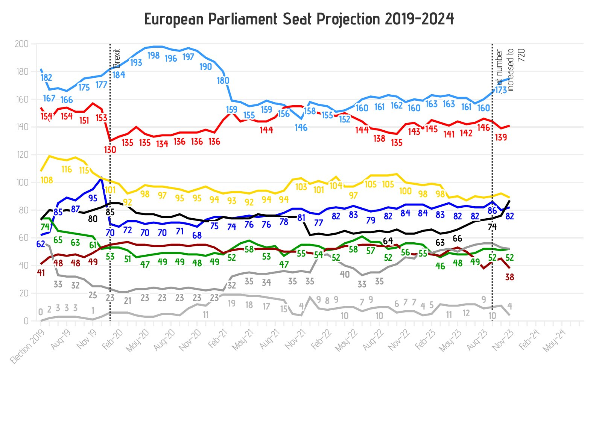

```{r setup, include=FALSE}
knitr::opts_chunk$set(echo = TRUE)
library(plotly)
library(tidyverse)
```

## Wykres do poprawy




Źródło: <https://x.com/EuropeElects/status/1730233161995440639?s=20>


Elementy wymagające poprawy:

- Na wykresie **brakuje legendy**.
- **Tytuł** jest nieadekwatny do treści; nie przedstawia danych z 2024 roku.
- Dane kończą się na Listopadzie 2023, więc **dalsze wartości na osi x są niepotrzebne**.
- **Nie wiadomo, do którego elementu linii są przyporządkowane opisy liczbowe**.
- **Liczby mające ułatwić odczyt wartości z wykresu obniżają jego czytelność**.
- **Ciężko przyporządkować fragment łamanej do daty**.
- **Opis drugiej pionowej linii przerywanej nie jest w pełni widoczny**.
- **Szary kolor czcionki na osiach pogarsza czytelność**.
- **Dwie najniższe linie mają podobny kolor**.
  
  
  

## Moja wizualizacja oraz kod do jej wygenerowania


```{r data, warning=FALSE, echo=TRUE}
mandaty <- read.csv("mandaty.csv")

mandaty <- mandaty %>%
  mutate(Date = factor(Date, levels = unique(Date)))


plot_ly(
  data = mandaty,
  x = ~ Date,
  y = ~ Seats,
  color = ~ Parties,
  colors = "Set1",
  type = "scatter",
  mode = "lines+markers",
  width = 1000,
  height = 800
) %>% layout(
  title = "European Parliament Seat Projestion 2019-2023",
  titlefont = list(size = 30, family = "ArialBold"),
  font = list(size = 14),
  xaxis = list(
    title = "",
    range = c("Election-19", "Nov-23"),
    showline = T,
    linecolor = 'rgba(204,204,204,1)',
    linewidth = 2,
    tiskmode = "auto",
    dtick = 3,
    fixedrange = T
  ),
  yaxis = list(
    title = "",
    range = c(0, 200.5),
    showline = T,
    linecolor = 'rgba(204,204,204,1)',
    linewidth = 2,
    gridwidth = 2,
    range = c(0, 200.5),
    tickvals = seq(0, 200, 20),
    fixedrange = T
  ),
  legend = list(orientation = "h"),
  shapes = list(
    list(
      type = "line",
      y0 = 0,
      y1 = 1,
      yref = "paper",
      x0 = "Jan-20",
      x1 = "Jan-20",
      line = list(color = "black",
                  dash = "dot")
    ),
    list(
      type = "line",
      y0 = 0,
      y1 = 1,
      yref = "paper",
      x0 = "Sep-23",
      x1 = "Sep-23",
      line = list(color = "black",
                  dash = "dot")
    )
  ),
  annotations = list(
    list(
      x = "Jan-20",
      y = 190,
      xref = "x",
      yref = "y",
      text = "Brexit",
      showarrow = FALSE,
      font = list(
        family = "ArialBold",
        size = 16,
        color = "black"
      ),
      textangle = -90,
      align = "left",
      xanchor = "left",
      yanchor = "middle"
    ),
    list(
      x = "Sep-23",
      y = 190,
      xref = "x",
      yref = "y",
      text = "Seat number\nincreased to 720",
      showarrow = FALSE,
      font = list(
        family = "ArialBold",
        size = 16,
        color = "black"
      ),
      textangle = -90,
      align = "left",
      xanchor = "left",
      yanchor = "middle"
    )
  ),
  margin = list(
    l = 50,
    r = 50,
    b = 20,
    t = 50
  )
)
``` 

W czym moja wizualizacja jest lepsza:

- Dodana została **legenda**, dzięki plotly można wyświatlić dane dla wybranych partii.
- Poprawiono **widoczność wartości na osiach**, co ułatwia odczyt danych.
- Opisy **pionowych linii przerywanych są widoczne**, co wpływa na czytelność wykresu.
- Wszystkie **partie mają znacząco różniące się od siebie kolory**, co ułatwia ich identyfikację.
- Dodane zostały **pionowe linie siatki oraz punkty**, umożliwiające szybsze przypisanie wartości do daty.
- **Interaktywność** zapewnia szybki i dokładny odczyt wartości, umożliwiając interakcję z wykresem.
- Poprawiono **tytuł** oraz usunięto niepotrzebną część osi x, co zwiększyło czytelność wizualizacji.

