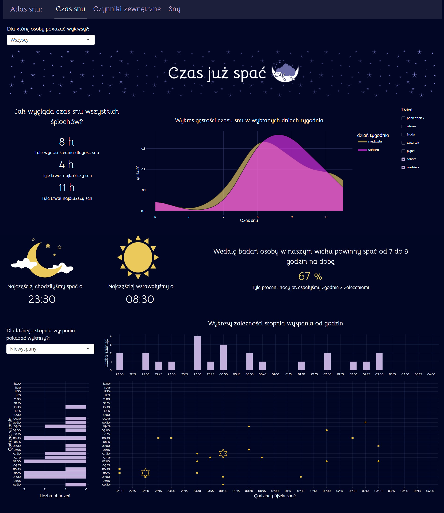
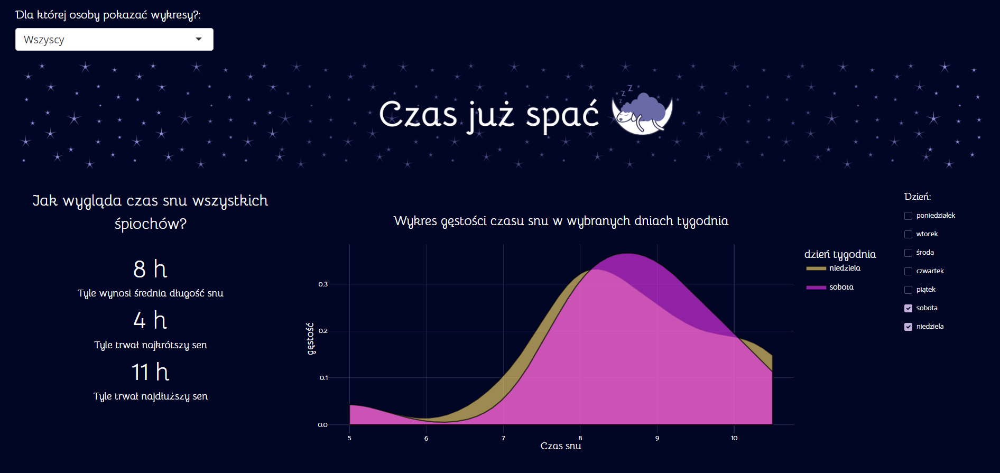
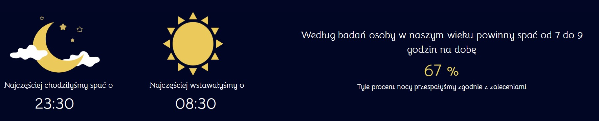
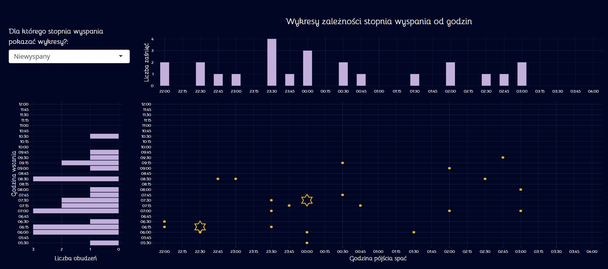
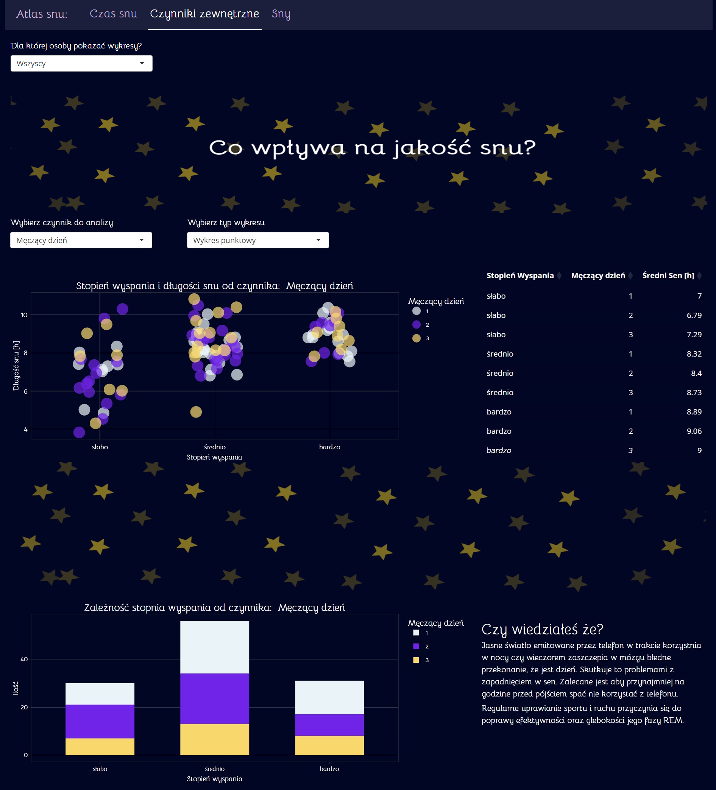
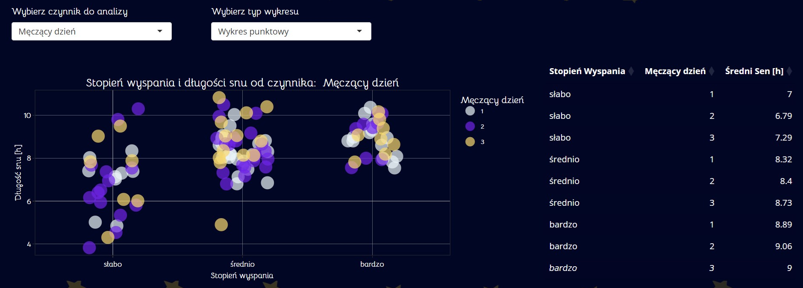
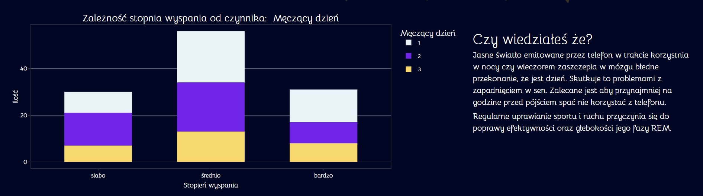
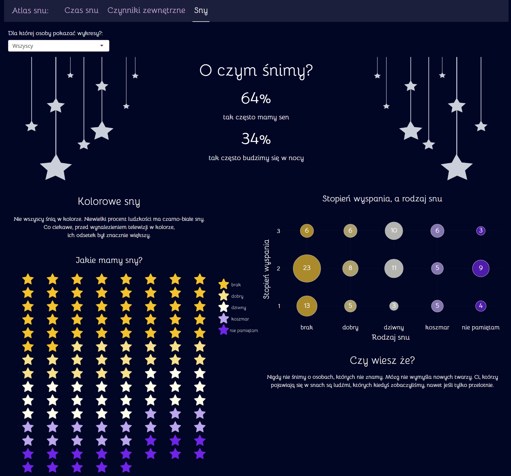
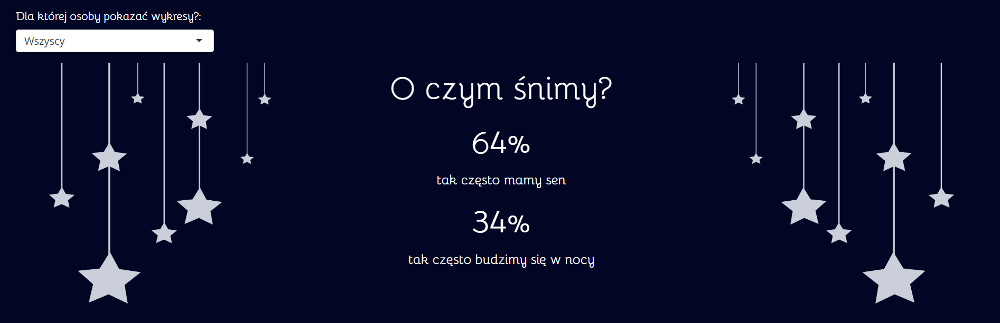
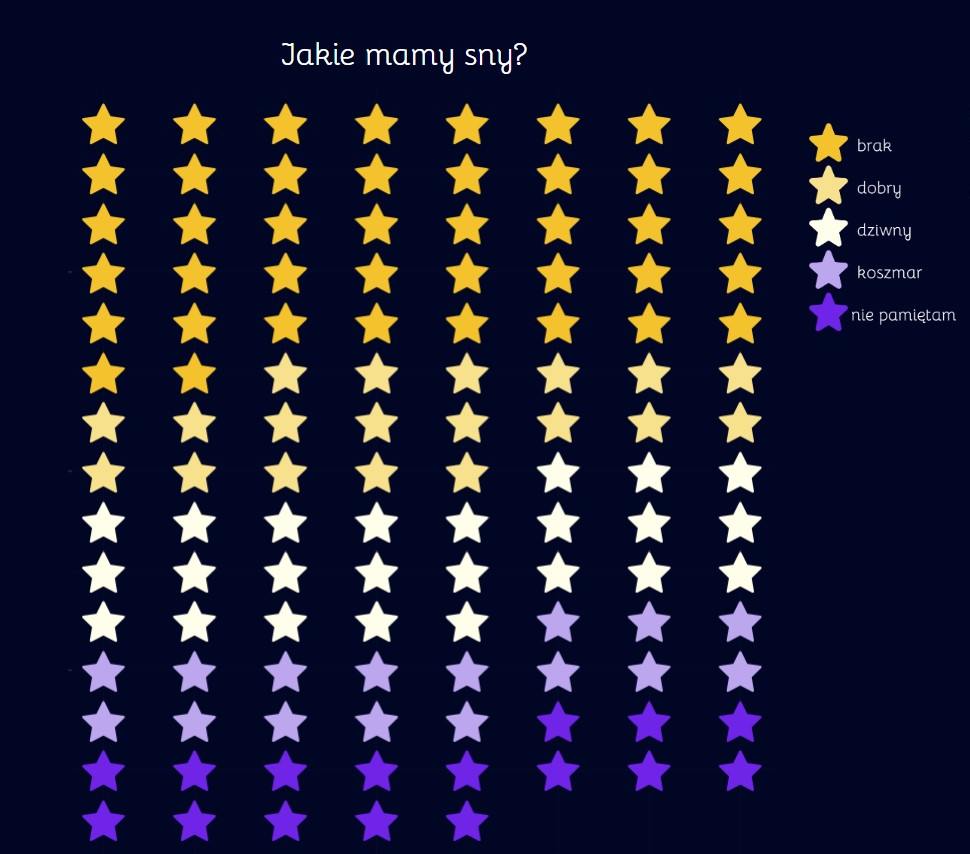

# Aplikacja Sen

Tematem naszej aplikacji jest analiza snu. Przez ostatnie kilkadziesiąt dni zbierałyśmy samodzielnie dane dotyczącze różnych aspektów naszego snu, aby zwizualizować je w postaci interaktywnych wykresów oraz informacji tekstowych. Do wygenerowania grafik używałyśmy strony [Canva](https://www.canva.com/).

[Link do filmu prezentującego nasz projekt](https://youtu.be/unM7Zj-k74w)

## Czas snu
Pierwsza strona aplikacji dotyczy statystyk związanych z czasem snu.

    

Najpierw wybieramy osobę, dla której chcemy wyświetlić dane.
Na górze strony pokazują się dane w postaci podsumowania tesktowego, które zawiera informacje takie jak długość najkrótszego oraz najdłuższego snu, jak i średnią długość snu dla wybranej osoby:
Po prawej stronie znajduje się wykres gęstości czasu snu w wybranych dniach tygodnia. Domyślnie na wykresie pokazane są dane dla soboty i niedzieli, ale można samodzielnie wybierać dni tygodnia, które chcemy zobaczyć wyświetlić:

    

Niżej mamy krótkie informacje o tym, o której godzinie wybrana osoba najczęściej zasypiała i wstawała oraz procent nocy, w których czas snu wyosił od 7 do 9 godzin:

    

Ostatnim elementem na tej stronie są połączone wykresy słupkowe oraz punktowy dla wybranego stopnia wyspania.
Na wykresie punktowym widzimy kombinacje godzin zaśnięcia i wstania dla danego stopnia wyspania, a na wykresach słupkowych zliczenia wystąpień danej godziny. Wielkość gwiazdki na wykresie punktowym informuje nas o tym ile razy dana kombinacja godzin się powtórzyła:

    

## Czynniki wpływające na sen

Na tej stronie analizujemy wpływ czynników na jakość i długość snu.

    

W pierwszej części możliwe jest wybranie osoby do analizy oraz konkretnych czynników, a poniżej wyświetla się interaktywny wykres punktowy lub wiolinowy dla wybranego czynnika
jak i  tabela przedstawiająca średnią długość snu w zależności od wybranego czynnika i stopnia wyspania:

    

Tabela jest interaktywna, umożliwia łatwe sortowanie kolumn rosnąco i malejąco.

W dolnej części strony znajduje się interaktywny wykres słupkowy, który pozwala zliczyć częstość występowania danego czynnika w zależności od stopnia wyspania oraz
ciekawostka dotycząca wpływu telefonu na jakość snu:

    

## Sny
Ostatnia strona aplikacji dotyczy naszych snów.Oprócz wykresów strona została również uzupełniona ciekawostkami dotyczącymi snów.

    

Na początku wybieramy osobę, dla której chcemy pokazać dane (możemy też wybrać wszystkie osoby).
Na górze strony widzimy informację, jak często wybrana osoba miała sen oraz jak często budziła się w nocy:

    

Niżej znajdują się dwa wykresy. Wykres waflowy (gwiazdkowy) pokazuje ile snów z danej kategorii miałyśmy:

    

Drugi wykres, bąbelkowy, pokazuje zależność między stopniem wyspania, a rodzajem snu. Zliczona jest również liczba każdej kombinacji:

    

## Autorzy

- [Katarzyna Rogalska](https://github.com/katarzynarogalska)
- [Urszula Szczęsna](https://github.com/ulaszczesna)
- [Natalia Choszczyk](https://github.com/nataliachoszczyk)

