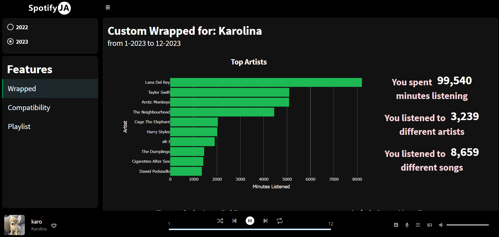

# SpotifyJA (Projekt JA)

Spotify data visualisation dashboard for Data Visualization Techniques course in the second year of Data Science studies at the Warsaw University of Technology. Authors: [@KarolinaDunal](https://github.com/xxkaro), [@FilipSzlingiert](https://github.com/FylypO) and [@BartlomiejWojcik](https://github.com/wojcikbart).

The aim was to prepare interactive dashboard which presents data analysis about authors. We chose data from music app - Spotify and visualized them in shiny dashboard.
To see the app click
**[here](https://fylypo.shinyapps.io/SpotifyApp/)**.

To see the video with a demonstration of our project click
**[here](https://youtu.be/z-zewK_lXxE)**.

  

