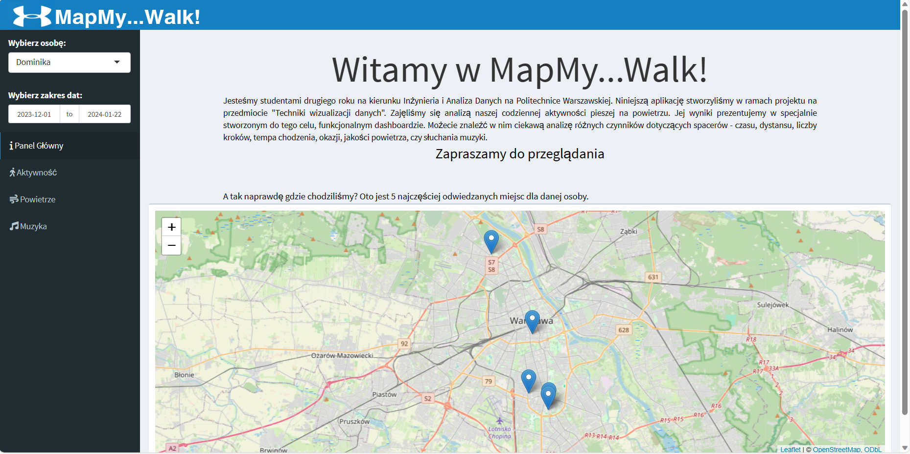
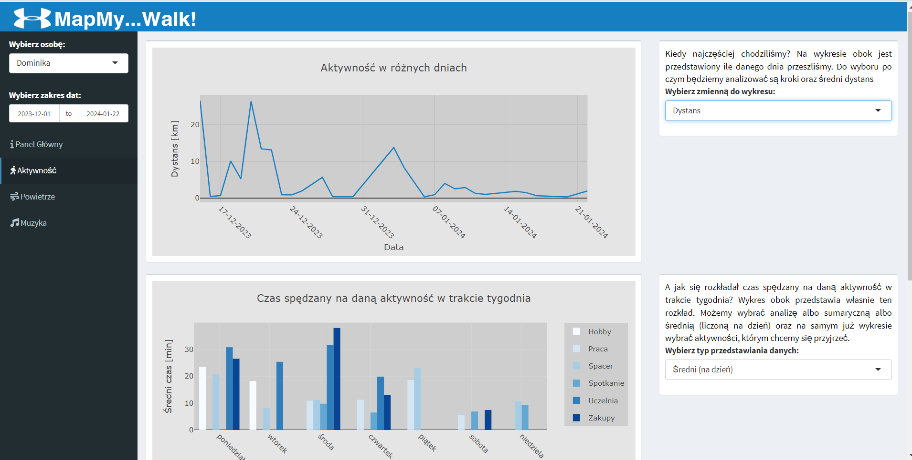
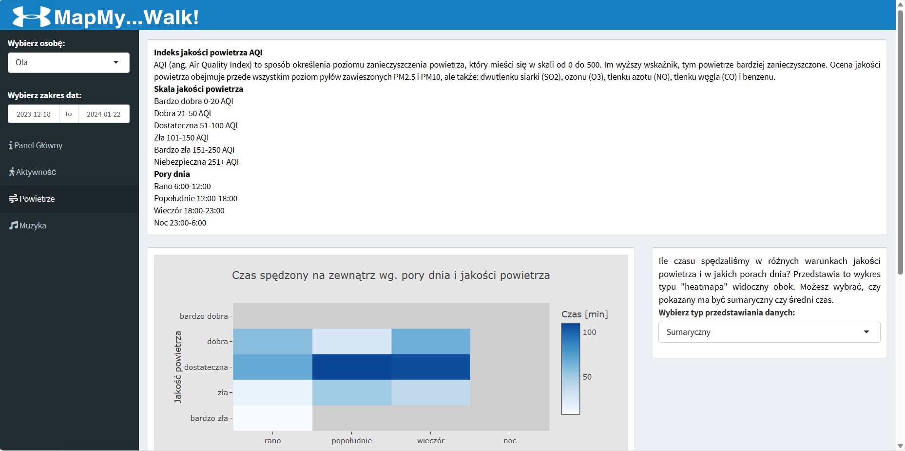
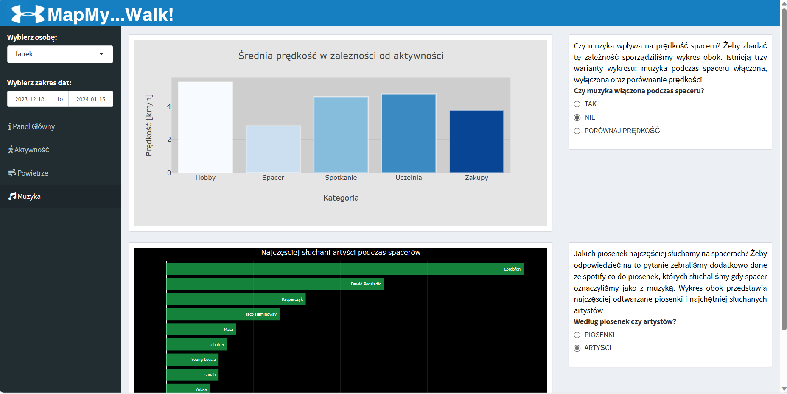

# MapMy...Walk!
 

Link do pobrania nagrania: https://mega.nz/file/ItgGHJja#Y4QMA5iMe2ZXlrjI156BlmCyGKoLVfFfrurJzLMrWF0

Link do obejrzenia nagrania: https://youtu.be/5F-_NUIdOLQ

Jako grupa projektowa mamy przyjemność zaprezentować Państwu naszą aplikację webową Map My Walk.
Jest to dashboard funkcjonalny, który przetwarza dane pochodzące z aplikacji MapMyRun, a także historię odsłuchanych piosenek ze Spotify. 

Przez ostatnie dwa miesiące systematycznie dokonywaliśmy pomiarów podczas naszych codziennych spacerów i zapisywaliśmy dodatkowe informacje takie jak jakość powietrza, cel spaceru, czy to, czy podczas danego spaceru słuchamy muzyki na Spotify, czy nie.

Efekty naszej pracy i analizy można podziwiać w skończonej aplikacji, która jest dostępna w tym repozytorium.
Pokrótce postaramy się Państwu przedstawić naszą aplikację analizując jej różne funkcje.

## Podstawowe funkcje

Aplikacja pozwala nam przełączać się między kartami, każda z nich analizuje inny aspekt naszych spacerów.

Menu z lewej strony pozwala nam na wybór osoby, której dane chcemy analizować, a także wybrać zakres dat, tzn. z jakich dni chcemy brać dane do wykresów.

## Panel główny

 

W panelu głównym zawarliśmy wszystkie najistotniejsze informacje wprowadzające dla użytkownika. Dodatkowo, zamieściliśmy mapę z biblioteki *leaflet*, która pokazuje jakie 5 miejsc najczęściej odwiedzała dana osoba w wybranym zakresie czasu.

## Aktywność

 

W zakładce *Aktywność* zaprezentowaliśmy wykresy przedstawiające różne zależności między typem wykonywanej aktywności a poświęconym jej czasem lub przebytym dystansem. Daliśmy tam też możliwość wyboru typu przedstawiania danych na wykresie (sumaryczny lub średni na dzień). Ponadto umieściliśmy tam wykres przedstawiający rozkład liczby kroków/dystansu na dzień w danym okresie czasu.

## Powietrze

 

W zakładce *Powietrze* umieściliśmy wykresy pokazujące związek jakości powietrza z tym, kiedy i ile chodziliśmy. Dane dotyczące aktualnej jakości powietrza braliśmy ze strony air.plumelabs.com. Zamieściliśmy również informacje wyjaśniające, czym jest indeks AQI stosowany do opisu stanu powietrza, jakiej używamy słownej skali jakości powietrza oraz jakim przedziałom czasowym odpowiadają poszczególne pory dnia.

## Muzyka

 

W zakładce *Muzyka* skupiliśmy się na pokazaniu, jakich utworów słuchaliśmy podczas spacerów oraz czy słuchanie muzyki wpływało na prędkość chodzenia. Dane zebraliśmy z aplikacji Spotify, której wszyscy używamy.

Mamy nadzieję, że nasza aplikacja przypadła Państwu do gustu. Życzymy smacznej kawusi 🥰
