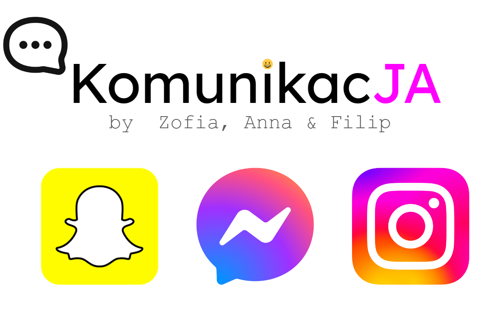

# Project ME (Projekt JA)

Personal data visualization performed as a project task for Data Visualization Techniques course in the second year of Data Science studies at the Warsaw University of Technology. Authors: [@FilipLangiewicz](https://github.com/FilipLangiewicz), [@ZosiaKaminska](https://github.com/kaminskaz) and [@AnnaOstrowska](https://github.com/annaostrowska03).

The aim of the project was to prepare an interactive dashboard/website about ME: visualizing the authors' activity through the prism of the Internet of Things (data from: Facebook, Google, YT, mail, wearables, bank, Spotify, Uber, etc.).

We downloaded data from platforms such as Facebook, Instagram and Snapchat, then analyzed it and created interactive visualizations using the plotly package (mainly). The result of our work is the 
**[KomunikacJA](https://gpla7.shinyapps.io/KomunikacJA/)** application. 

  

