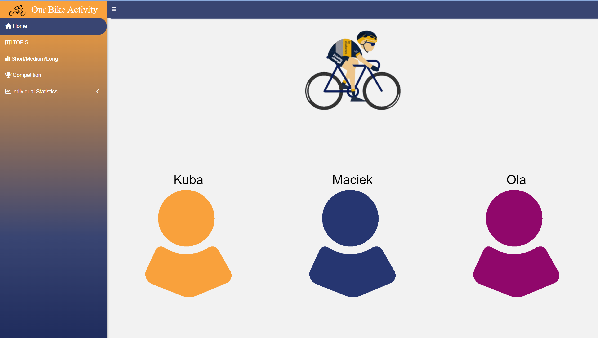
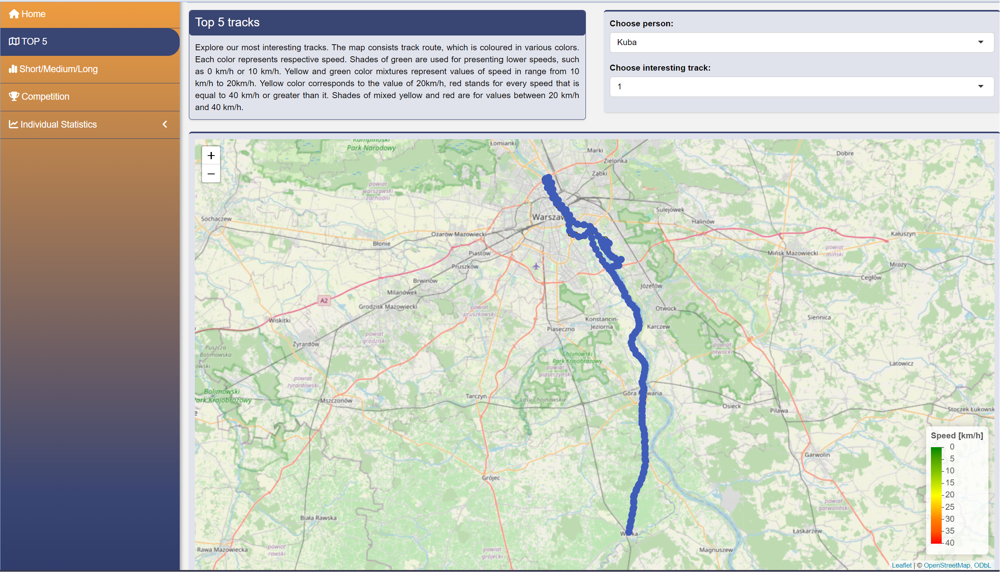
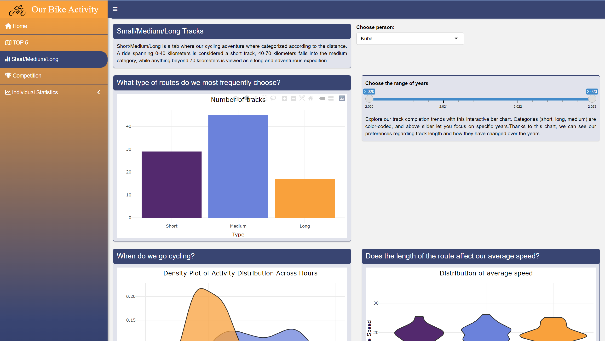
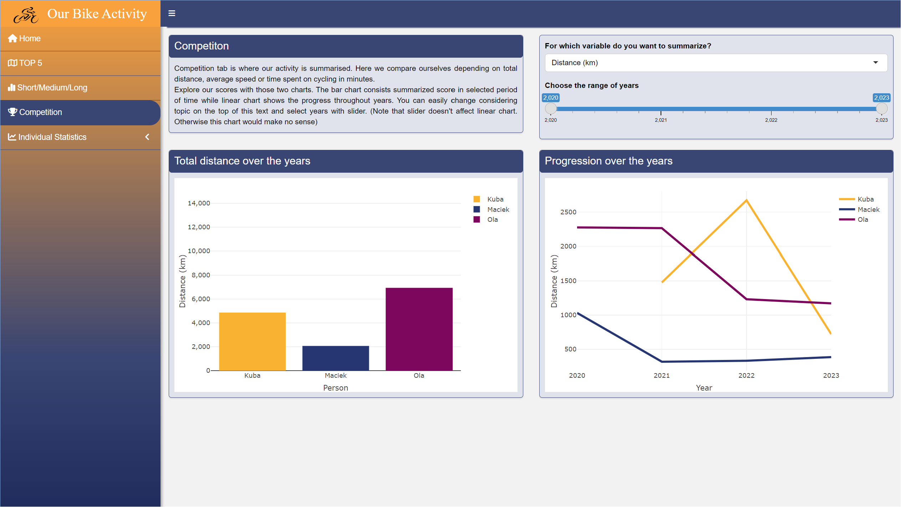
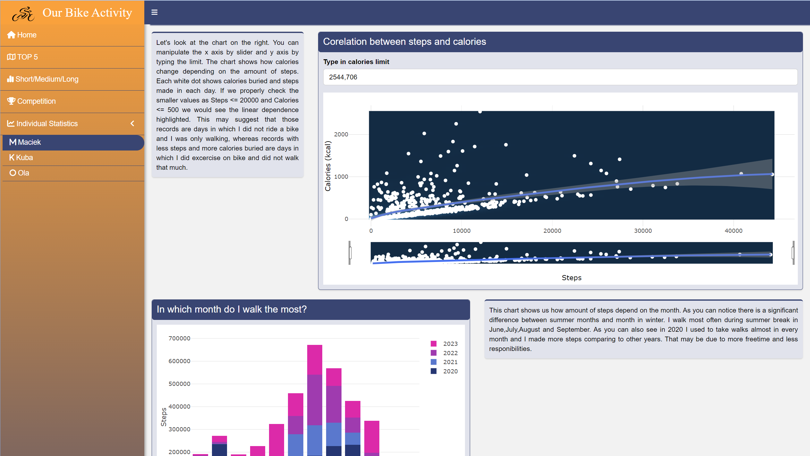
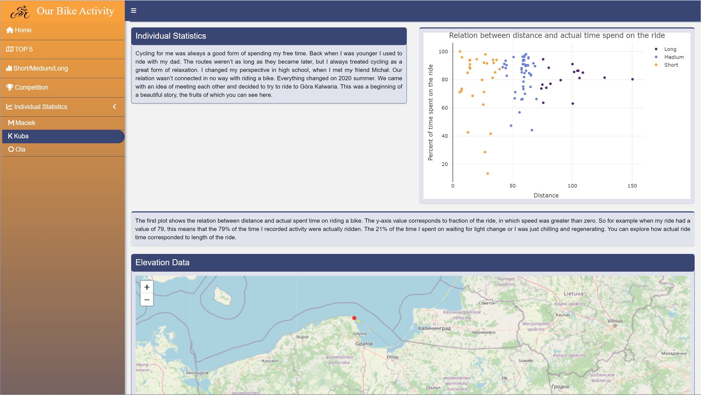
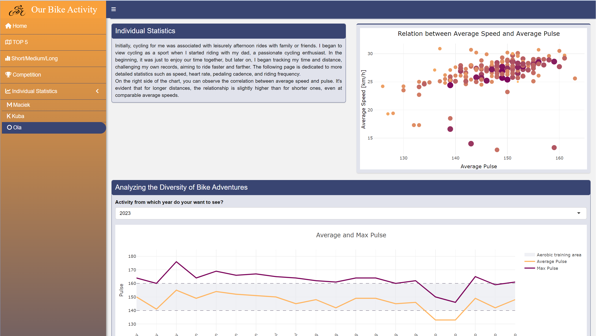

# Our Bike activity
This R project was done as a part of [Data Visualization Techniques](https://github.com/kozaka93/2023Z-DataVisualizationTechniques) course. To check how our project repository looks like, click this [link](https://github.com/DataVisualizationTechniquesProject2/Project2). The application was build by [Aleksandra Kwiatkowska](https://github.com/Alexa263), [Maciej Momot](https://github.com/MaciejMomot) and [Jakub Półtorak](https://github.com/JakubPoltorak147).

As we all are sport enthiusiasts, we have decided to analise and visualize data from our bike activities. We have managed to get data from 3 applications: Strava, Huawei Health and Garmin Connect. Check out, how our project looks like and what we included in our tabs. But before that watch the video, where we present our app. Watch it [here](https://www.youtube.com/watch?v=3BAXike0Y0o).

## Table of Contents  
- [Installation](#installation) 
- [App content](#AppContent) 
## Installation  
To clone this repository, use the following `git` command: 

`git clone https://github.com/DataVisualizationTechniquesProject2/Project2`

Now you just have to open your RStudio app or other developer tool, where you can run R files. Import the the `app.R` file and install necesarry packages. 
Check whether you have all of these packages installed, if not copy code below to install those, which you don't have.

`install.packages(shiny)`

`install.packages(shinydashboard)`

`install.packages(ggplot2)`

`install.packages(plotly)`

`install.packages(dplyr)`

`install.packages(fresh)`

`install.packages(lubridate)`

`install.packages(tidyverse)`

`install.packages(viridis)`

`install.packages(htmltools)`

`install.packages(scales)`

`install.packages(leaflet)`

`install.packages(geosphere)`

`install.packages(htmlwidgets)`

`install.packages(dashboardthemes)`

`install.packages(shinycssloaders)`

`install.packages(magick)`

Now you can run the `app.R` and enjoy our bike content!

## App Content
1. Homepage

On homepage, we put gif of a cyclist and also 3 icons. The same colors of icons were used in the whole project to identify our individual data.

 

2. Top 5 Activities

In this tab, we visualized our most interesting tracks. Everyone chose 5 of them. We put our geolocalization data on a map and added info about mean speed at each part of the ride.

 

3. Short/Medium/Long

This tab is about our rides in terms of their length. We have divided our activities into the 3 sections: Short, Medium and Long. We then visualized some interesting facts connected with this partition.

 

4. Competition

Competition tab is the place, where we compared each other in different areas. We have merged our data and tried to find some resemblances between our rides.

 

5. Individual Maciek

This tab contains info about Maciek's personal statistics.

 

6. Individual Kuba

This tab contains info about Kuba's personal statistics.

 

7. Individual Ola

This tab contains info about Ola's personal statistics.

 
